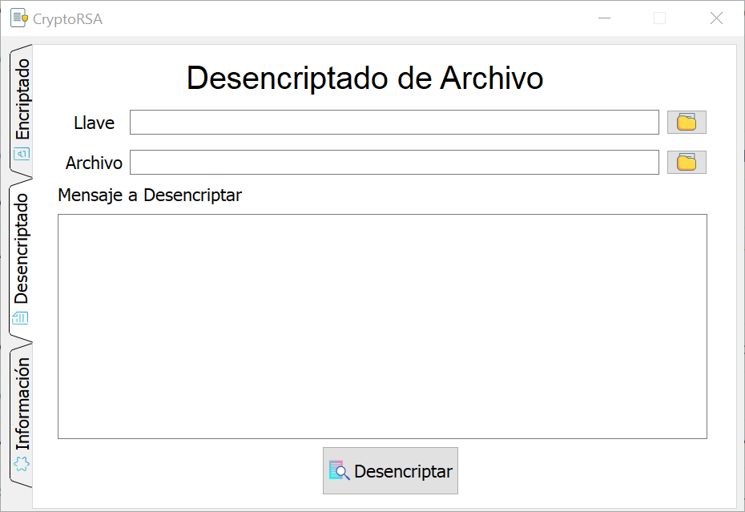

# Encriptación y Desencriptación con RSA 
El proyecto consiste en escribir un programa capaz de encriptar y desencriptar un mensaje, utilizando el sistema criptográfico RSA.

<p align="center">
  </img>
</p>

## Requerimientos del sistema

Para su ejecución es requerido **Python 3.8**, además de contar con los módulos utilizados en el programa, el cual se puede hacer mediante el archivo **requirements.txt**, con el siguiente comando en la Terminal o en el CMD:

```console
$ pip install -r requirements.txt
```

## Ejecutar Aplicación

Para iniciar el programa se debe ejecutar el siguiente comando en la Terminal o en el CMD.

```console
$ python CryptoRSA.py
```

## Referencias
Akkila, I. (2017). *Black Hat Python - Encrypt and Decrypt with RSA Cryptography*. Extraído de:  [https://medium.com/@ismailakkila/black-hat-python-encrypt-and-decrypt-with-rsa-cryptography-bd6df84d65bc](https://medium.com/@ismailakkila/black-hat-python-encrypt-and-decrypt-with-rsa-cryptography-bd6df84d65bc)

Fitzpatrick, M. (s.f.) *Dialogs and Alerts*. Extraído de: [https://medium.com/@ismailakkila/black-hat-python-encrypt-and-decrypt-with-rsa-cryptography-bd6df84d65bc](https://www.learnpyqt.com/tutorials/dialogs/)

Grimaldi, R. y Ramana, B. (2004). *Discrete and Combinatorial Mathematics: An Applied Introduction*. Fifth Edition. Uttar Pradesh, India: Pearson. 793 - 797 pp.

Nakov, S. (2019). *RSA Encrypt/Decrypt - Examples*. Extraído de: [https://medium.com/@ismailakkila/black-hat-python-encrypt-and-decrypt-with-rsa-cryptography-bd6df84d65bc](https://cryptobook.nakov.com/asymmetric-key-ciphers/rsa-encrypt-decrypt-examples)
